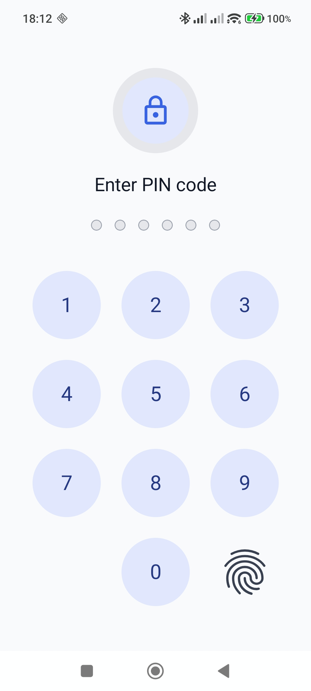
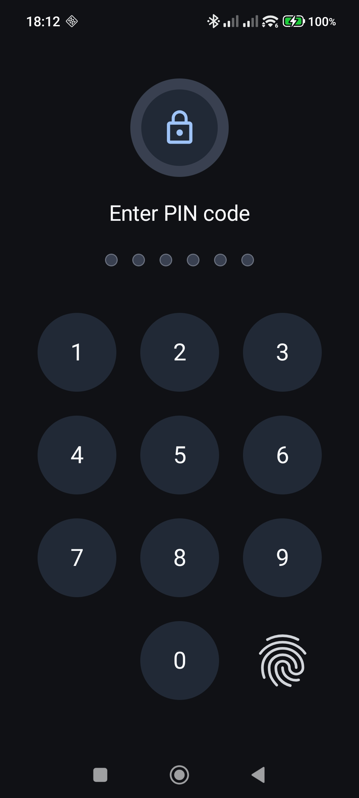

# 🔐 LockPassword

<p align="center">
  <b>Secure, customizable PIN lock screen for Android</b><br/>
 Ready-to-use lock screen Activity for Android apps with biometric authentication, secure PIN handling, and UI customization for Kotlin and Java.
</p>

<p align="center">
  
  &nbsp;
  
  &nbsp;
  
  &nbsp;
  
</p>

---

## 🎬 Demo

<p align="center">
  
</p>

<p align="center">
  
  &nbsp;&nbsp;
  
</p>

---

## ✨ Features

- 🔐 PBKDF2-based PIN storage with Android Keystore integration
- 👆 Biometric authentication via Android BiometricPrompt
- 🎨 Light and dark theme color customization
- 🔘 Keypad button size customization
- ☕ Works with both Kotlin and Java
- 🧩 Can be integrated into Compose and classic View/XML apps
- 🚫 Brute-force protection with lockout policy
- ⚡ Ready-to-use Activity API

---

## 📌 When to Use

LockPassword is a good fit for:

- protecting notes, drafts, or private sections of an app
- restricting access to settings or admin screens
- requiring quick authentication before opening sensitive content
- adding biometric + PIN protection without building a custom lock screen from scratch

---

## 📦 Installation

Make sure `mavenCentral()` is included in your project repositories, then add the library using one of the following approaches.

### `settings.gradle.kts`

```kotlin
dependencyResolutionManagement {
    repositoriesMode.set(RepositoriesMode.FAIL_ON_PROJECT_REPOS)
    repositories {
        google()
        mavenCentral()
    }
}
```

### Option 1. Version Catalog

Recommended if your project already uses libs.versions.toml.

```toml
[versions]
lockpassword = "1.0.1"

[libraries]
lockpassword = { group = "ru.devasn", name = "lockpassword", version.ref = "lockpassword" }
```

Then use it in `build.gradle.kts`:

```kotlin
dependencies {
    implementation(libs.lockpassword)
}
```


### Option 2. Direct dependency (`build.gradle.kts`)

Simplest setup if you do not use Version Catalog.

```kotlin
dependencies {
    implementation("ru.devasn:lockpassword:1.0.1")
}
```


---


## 🚀 Quick Start

LockPassword uses a simple flow:

1. Create an intent with LockPasswordLauncher and launch it via the Activity Result API
2. If a PIN does not exist yet, the user creates one
3. If a PIN already exists, the library authenticates the user and returns `LockPasswordResult`

> LockPassword internally uses Jetpack Compose, but it can be integrated into both Compose and classic View/XML Android applications.

### Kotlin (Compose)

```kotlin
class MainActivity : ComponentActivity() {

    private val tag = "LockPasswordDemo"

    private val lockPasswordLauncher = registerForActivityResult(
        ActivityResultContracts.StartActivityForResult()
    ) { result ->
        val lockResult = LockPasswordResult.fromActivityResult(result)

        when (lockResult.code) {
            LockPasswordResult.Code.SUCCESS -> {
                Log.d(tag, "Authentication succeeded")
            }

            LockPasswordResult.Code.PIN_CREATED -> {
                Log.d(tag, "PIN created")
            }

            LockPasswordResult.Code.CANCELLED -> {
                Log.d(tag, "Cancelled by user")
            }

            LockPasswordResult.Code.ERROR -> {
                Log.d(tag, "Error. message=${lockResult.message}")
            }
        }
    }

    override fun onCreate(savedInstanceState: Bundle?) {
        super.onCreate(savedInstanceState)
        enableEdgeToEdge()

        setContent {
            MaterialTheme {
                Surface(
                    modifier = Modifier.fillMaxSize(),
                    color = MaterialTheme.colorScheme.background
                ) {
                    Box(
                        modifier = Modifier.fillMaxSize(),
                        contentAlignment = Alignment.Center
                    ) {
                        Button(
                            onClick = {
                                val intent = LockPasswordLauncher.createIntent(
                                    context = this@MainActivity,
                                    biometricEnabled = true
                                )

                                lockPasswordLauncher.launch(intent)
                            }
                        ) {
                           Text("Open LockPassword")
                        }
                    }
                }
            }
        }
    }
}
```

### Kotlin (View/XML or classic Activity-based)

```kotlin
private val tag = "LockPasswordDemo"

private val lockPasswordLauncher = registerForActivityResult(
    ActivityResultContracts.StartActivityForResult()
) { result ->
    val lockResult = LockPasswordResult.fromActivityResult(result)

    when (lockResult.code) {
        LockPasswordResult.Code.SUCCESS -> {
            Log.d(tag, "Authentication succeeded")
        }

        LockPasswordResult.Code.PIN_CREATED -> {
            Log.d(tag, "PIN created")
        }

        LockPasswordResult.Code.CANCELLED -> {
            Log.d(tag, "Cancelled by user")
        }

        LockPasswordResult.Code.ERROR -> {
            Log.d(tag, "Error. message=${lockResult.message}")
        }
    }
}

val intent = LockPasswordLauncher.createIntent(
    context = this,
    biometricEnabled = true
)

lockPasswordLauncher.launch(intent)
```

### Java

```java
private static final String TAG = "LockPasswordDemo";
private ActivityResultLauncher<Intent> lockPasswordLauncher;

private void setupLockPasswordLauncher() {
    lockPasswordLauncher = registerForActivityResult(
            new ActivityResultContracts.StartActivityForResult(),
            result -> {
                LockPasswordResult lockResult = LockPasswordResult.fromActivityResult(result);

                switch (lockResult.getCode()) {
                    case SUCCESS:
                        Log.d(TAG, "Authentication succeeded");
                        break;

                    case PIN_CREATED:
                        Log.d(TAG, "PIN created");
                        break;

                    case CANCELLED:
                        Log.d(TAG, "Cancelled by user");
                        break;

                    case ERROR:
                    default:
                        Log.d(TAG, "Error. message=" + lockResult.getMessage());
                        break;
                }
            }
    );
}

private void openLockPassword() {
    Intent intent = LockPasswordLauncher.createIntent(
            this,
            true
    );

    lockPasswordLauncher.launch(intent);
}
```

---

## 🔐 Security Configuration

You can pass `securityConfig` to configure PIN length, security preset, PBKDF2 settings, and lockout behavior.

### Available Options

| Property | Type | Default | Description |
|---|---|---|---|
| `pinLength` | `Int` | `6` | Required PIN length. Supported range: 4..6. |
| `securityPreset` | `LockPasswordSecurityPreset` | `BALANCED` | Security preset: `FAST`, `BALANCED`, `STRONG`, or `CUSTOM`. |
| `customPbkdf2Iterations` | `Int?` | `null` | Custom PBKDF2 iteration count. Required only when `securityPreset = CUSTOM`. |
| `useKeystoreWrapping` | `Boolean` | `true` | Enables additional Android Keystore-based wrapping for derived data. |
| `saltSizeBytes` | `Int` | `16` | Salt size in bytes. Allowed range: `16..64`. |
| `derivedKeySizeBytes` | `Int` | `32` | Derived key size in bytes. Allowed range: `16..64`. |
| `maxFailedAttemptsBeforeLockout` | `Int` | `5` | Number of failed attempts allowed before lockout begins. Must be greater than `0`. |
| `lockoutScheduleMs` | `List<Long>` | `[30000, 60000, 120000, 300000, 900000]` | Lockout durations in milliseconds after repeated failed attempts. |

### PIN Length

`LockPassword` currently supports PIN length from `4` to `6`.

#### Kotlin

```kotlin
val intent = LockPasswordLauncher.createIntent(
    context = this,
    biometricEnabled = true,
    securityConfig = LockPasswordSecurityConfig(pinLength = 4)
)
```

#### Java

```java
LockPasswordSecurityConfig securityConfig = new LockPasswordSecurityConfig.Builder()
        .setPinLength(4)      
        .build();

Intent intent = LockPasswordLauncher.createIntent(
        this,
        true,
        LockPasswordDefaults.uiConfig(),
        securityConfig
);
```

### Security Presets

- `FAST` — faster verification, lower computational cost
- `BALANCED` — recommended default preset
- `STRONG` — stronger protection with higher verification cost
- `CUSTOM` — manual PBKDF2 iteration configuration

### Custom Preset

Use `CUSTOM` when you need to define your own PBKDF2 iteration count.

#### Kotlin

```kotlin
val intent = LockPasswordLauncher.createIntent(
    context = this,
    biometricEnabled = true,
    securityConfig = LockPasswordSecurityConfig(
        pinLength = 6,
        securityPreset = LockPasswordSecurityPreset.CUSTOM,
        customPbkdf2Iterations = 250000
    )
)
```

#### Java

```java
LockPasswordSecurityConfig securityConfig = new LockPasswordSecurityConfig.Builder()
        .setPinLength(6)
        .setSecurityPreset(LockPasswordSecurityPreset.CUSTOM)
        .setCustomPbkdf2Iterations(250000)
        .build();

Intent intent = LockPasswordLauncher.createIntent(
        this,
        true,
        LockPasswordDefaults.uiConfig(),
        securityConfig
);

lockPasswordLauncher.launch(intent);
```

---

### Full Configuration

Use the full configuration only if you need to customize lockout behavior or advanced security options.

#### Kotlin

```kotlin
val intent = LockPasswordLauncher.createIntent(
    context = this,
    biometricEnabled = true,
    securityConfig = LockPasswordSecurityConfig(
        pinLength = 6,
        securityPreset = LockPasswordSecurityPreset.BALANCED,
        useKeystoreWrapping = true,
        saltSizeBytes = 16,
        derivedKeySizeBytes = 32,
        maxFailedAttemptsBeforeLockout = 5,
        lockoutScheduleMs = listOf(30_000L, 60_000L, 120_000L, 300_000L, 900_000L)
    )
)
```

#### Java

```java
LockPasswordSecurityConfig securityConfig = new LockPasswordSecurityConfig.Builder()
        .setPinLength(6)
        .setSecurityPreset(LockPasswordSecurityPreset.BALANCED)
        .setUseKeystoreWrapping(true)
        .setSaltSizeBytes(16)
        .setDerivedKeySizeBytes(32)
        .setMaxFailedAttemptsBeforeLockout(5)
        .setLockoutScheduleMs(Arrays.asList(30000L, 60000L, 120000L, 300000L, 900000L))
        .build();

Intent intent = LockPasswordLauncher.createIntent(
        this,
        true,
        LockPasswordDefaults.uiConfig(),
        securityConfig
);
```


## 🎨 Customize UI

### Change Button Size

`buttonScale` changes the size of the numeric keypad buttons.

- `1.0f` — default size
- `> 1.0f` — larger buttons
- `< 1.0f` — smaller buttons

Recommended practical range:

- `0.90f` to `1.15f`

#### Kotlin

```kotlin
val uiConfig = LockPasswordDefaults.uiConfig().apply {
    sizes.buttonScale = 1.08f
}
```

#### Java

```java
LockPasswordUiConfig uiConfig = LockPasswordDefaults.uiConfig();
uiConfig.getSizes().setButtonScale(1.08f);
```

### Change Colors

LockPassword uses separate color sets for different themes:

- `lightColors` — colors for the light theme
- `darkColors` — colors for the dark theme

Available color properties:

| Property | Description |
|------|------|
| `screenBackgroundColor` | Background color of the entire screen |
| `titleColor` | Title text color |
| `keypadButtonBackgroundColor` | Background color of numeric keypad buttons |
| `keypadDigitColor` | Color of keypad digits |
| `lockOuterCircleColor` | Color of the outer lock circle |
| `lockInnerCircleColor` | Color of the inner lock circle |
| `lockIconColor` | Color of the lock icon |
| `dotEmptyColor` | Color of empty PIN dots |
| `dotFilledColor` | Color of filled PIN dots |
| `dotBorderColor` | Border color of PIN dots |
| `actionIconColor` | Color of action icons (delete / biometric) |
| `actionTextColor` | Color of action text buttons |
| `errorTextColor` | Error text color |
| `errorBackgroundColor` | Error message background color |
| `messageTextColor` | Regular message text color |

#### Kotlin Compose

```kotlin
val uiConfig = LockPasswordDefaults.uiConfig().apply {
    lightColors.screenBackgroundColor = Color(0xFFF8FAFC).toArgb()
    lightColors.titleColor = Color(0xFF111827).toArgb()
    lightColors.keypadButtonBackgroundColor = Color(0xFFE0E7FF).toArgb()
    lightColors.keypadDigitColor = Color(0xFF1E3A8A).toArgb()
    lightColors.lockIconColor = Color(0xFF2563EB).toArgb()

    darkColors.screenBackgroundColor = Color(0xFF0F1115).toArgb()
    darkColors.titleColor = Color(0xFFF9FAFB).toArgb()
    darkColors.keypadButtonBackgroundColor = Color(0xFF1F2937).toArgb()
    darkColors.keypadDigitColor = Color(0xFFF9FAFB).toArgb()
    darkColors.lockIconColor = Color(0xFF93C5FD).toArgb()
}
```

#### Kotlin (View/XML or classic Activity-based)

```kotlin
val uiConfig = LockPasswordDefaults.uiConfig().apply {
    lightColors.screenBackgroundColor = 0xFFF8FAFC.toInt()
    lightColors.titleColor = 0xFF111827.toInt()
    lightColors.keypadButtonBackgroundColor = 0xFFE0E7FF.toInt()
    lightColors.keypadDigitColor = 0xFF1E3A8A.toInt()
    lightColors.lockIconColor = 0xFF2563EB.toInt()

    darkColors.screenBackgroundColor = 0xFF0F1115.toInt()
    darkColors.titleColor = 0xFFF9FAFB.toInt()
    darkColors.keypadButtonBackgroundColor = 0xFF1F2937.toInt()
    darkColors.keypadDigitColor = 0xFFF9FAFB.toInt()
    darkColors.lockIconColor = 0xFF93C5FD.toInt()
}
```

#### Java

```java
LockPasswordUiConfig uiConfig = LockPasswordDefaults.uiConfig();

uiConfig.getLightColors().setScreenBackgroundColor(0xFFF8FAFC);
uiConfig.getLightColors().setTitleColor(0xFF111827);
uiConfig.getLightColors().setKeypadButtonBackgroundColor(0xFFE0E7FF);
uiConfig.getLightColors().setKeypadDigitColor(0xFF1E3A8A);
uiConfig.getLightColors().setLockIconColor(0xFF2563EB);

uiConfig.getDarkColors().setScreenBackgroundColor(0xFF0F1115);
uiConfig.getDarkColors().setTitleColor(0xFFF9FAFB);
uiConfig.getDarkColors().setKeypadButtonBackgroundColor(0xFF1F2937);
uiConfig.getDarkColors().setKeypadDigitColor(0xFFF9FAFB);
uiConfig.getDarkColors().setLockIconColor(0xFF93C5FD);
```

---


## 🧩 Full Example

This section shows full integration examples for all supported Android usage styles: Jetpack Compose, classic View/XML with Kotlin, and Java integration.

### Kotlin (Compose)

```kotlin
class MainActivity : ComponentActivity() {

    private val tag = "LockPasswordDemo"

    private val lockPasswordLauncher = registerForActivityResult(
        ActivityResultContracts.StartActivityForResult()
    ) { result ->
        val lockResult = LockPasswordResult.fromActivityResult(result)

        when (lockResult.code) {
            LockPasswordResult.Code.SUCCESS -> {
                Log.d(tag, "Authentication succeeded")
            }

            LockPasswordResult.Code.PIN_CREATED -> {
                Log.d(tag, "PIN created")
            }

            LockPasswordResult.Code.CANCELLED -> {
                Log.d(tag, "Cancelled by user")
            }

            LockPasswordResult.Code.ERROR -> {
                Log.d(tag, "Error. message=${lockResult.message}")
            }
        }
    }

    override fun onCreate(savedInstanceState: Bundle?) {
        super.onCreate(savedInstanceState)
        enableEdgeToEdge()

        setContent {
            MaterialTheme {
                Surface(
                    modifier = Modifier.fillMaxSize(),
                    color = MaterialTheme.colorScheme.background
                ) {
                    Box(
                        modifier = Modifier.fillMaxSize(),
                        contentAlignment = Alignment.Center
                    ) {
                        Button(
                            onClick = {
                                val uiConfig = LockPasswordDefaults.uiConfig().apply {
                                    sizes.buttonScale = 1.08f

                                    lightColors.screenBackgroundColor = Color(0xFFF8FAFC).toArgb()
                                    lightColors.titleColor = Color(0xFF111827).toArgb()
                                    lightColors.keypadButtonBackgroundColor = Color(0xFFE0E7FF).toArgb()
                                    lightColors.keypadDigitColor = Color(0xFF1E3A8A).toArgb()
                                    lightColors.lockOuterCircleColor = Color(0xFFE5E7EB).toArgb()
                                    lightColors.lockInnerCircleColor = Color(0xFFE0E7FF).toArgb()
                                    lightColors.lockIconColor = Color(0xFF2563EB).toArgb()
                                    lightColors.dotEmptyColor = Color(0xFFE5E7EB).toArgb()
                                    lightColors.dotFilledColor = Color(0xFF2563EB).toArgb()
                                    lightColors.dotBorderColor = Color(0xFF9CA3AF).toArgb()
                                    lightColors.actionIconColor = Color(0xFF374151).toArgb()
                                    lightColors.actionTextColor = Color(0xFF374151).toArgb()
                                    lightColors.errorTextColor = Color(0xFFB3261E).toArgb()
                                    lightColors.errorBackgroundColor = Color(0xFFFFDAD6).toArgb()
                                    lightColors.messageTextColor = Color(0xFF374151).toArgb()

                                    darkColors.screenBackgroundColor = Color(0xFF0F1115).toArgb()
                                    darkColors.titleColor = Color(0xFFF9FAFB).toArgb()
                                    darkColors.keypadButtonBackgroundColor = Color(0xFF1F2937).toArgb()
                                    darkColors.keypadDigitColor = Color(0xFFF9FAFB).toArgb()
                                    darkColors.lockOuterCircleColor = Color(0xFF374151).toArgb()
                                    darkColors.lockInnerCircleColor = Color(0xFF1F2937).toArgb()
                                    darkColors.lockIconColor = Color(0xFF93C5FD).toArgb()
                                    darkColors.dotEmptyColor = Color(0xFF374151).toArgb()
                                    darkColors.dotFilledColor = Color(0xFF93C5FD).toArgb()
                                    darkColors.dotBorderColor = Color(0xFF6B7280).toArgb()
                                    darkColors.actionIconColor = Color(0xFFD1D5DB).toArgb()
                                    darkColors.actionTextColor = Color(0xFFD1D5DB).toArgb()
                                    darkColors.errorTextColor = Color(0xFFCF6679).toArgb()
                                    darkColors.errorBackgroundColor = Color(0xFF601410).toArgb()
                                    darkColors.messageTextColor = Color(0xFFD1D5DB).toArgb()
                                }

                                val intent = LockPasswordLauncher.createIntent(
                                    context = this@MainActivity,
                                    biometricEnabled = true,
                                    uiConfig = uiConfig,
                                    securityConfig = LockPasswordSecurityConfig(
									    pinLength = 6,
                                        securityPreset = LockPasswordSecurityPreset.BALANCED,
                                        useKeystoreWrapping = true,
                                        saltSizeBytes = 16,
                                        derivedKeySizeBytes = 32,
                                        maxFailedAttemptsBeforeLockout = 5,
                                        lockoutScheduleMs = listOf(30_000L, 60_000L, 120_000L, 300_000L, 900_000L)
                                    )                       
                                )

                                lockPasswordLauncher.launch(intent)
                            }
                        ) {
                            Text(text = stringResource(R.string.open_lockpassword))
                        }
                    }
                }
            }
        }
    }
}
```

### Kotlin (View/XML or classic Activity-based)

```kotlin
private val tag = "LockPasswordDemo"

val uiConfig = LockPasswordDefaults.uiConfig().apply {
    sizes.buttonScale = 1.08f

    lightColors.screenBackgroundColor = 0xFFF8FAFC.toInt()
    lightColors.titleColor = 0xFF111827.toInt()
    lightColors.keypadButtonBackgroundColor = 0xFFE0E7FF.toInt()
    lightColors.keypadDigitColor = 0xFF1E3A8A.toInt()
    lightColors.lockOuterCircleColor = 0xFFE5E7EB.toInt()
    lightColors.lockInnerCircleColor = 0xFFE0E7FF.toInt()
    lightColors.lockIconColor = 0xFF2563EB.toInt()
    lightColors.dotEmptyColor = 0xFFE5E7EB.toInt()
    lightColors.dotFilledColor = 0xFF2563EB.toInt()
    lightColors.dotBorderColor = 0xFFCBD5E1.toInt()
    lightColors.actionIconColor = 0xFF2563EB.toInt()
    lightColors.actionTextColor = 0xFF111827.toInt()
    lightColors.errorTextColor = 0xFF991B1B.toInt()
    lightColors.errorBackgroundColor = 0xFFFEE2E2.toInt()
    lightColors.messageTextColor = 0xFF475569.toInt()

    darkColors.screenBackgroundColor = 0xFF0F1115.toInt()
    darkColors.titleColor = 0xFFF9FAFB.toInt()
    darkColors.keypadButtonBackgroundColor = 0xFF1F2937.toInt()
    darkColors.keypadDigitColor = 0xFFF9FAFB.toInt()
    darkColors.lockOuterCircleColor = 0xFF374151.toInt()
    darkColors.lockInnerCircleColor = 0xFF1F2937.toInt()
    darkColors.lockIconColor = 0xFF93C5FD.toInt()
    darkColors.dotEmptyColor = 0xFF374151.toInt()
    darkColors.dotFilledColor = 0xFF93C5FD.toInt()
    darkColors.dotBorderColor = 0xFF4B5563.toInt()
    darkColors.actionIconColor = 0xFF93C5FD.toInt()
    darkColors.actionTextColor = 0xFFF9FAFB.toInt()
    darkColors.errorTextColor = 0xFFFCA5A5.toInt()
    darkColors.errorBackgroundColor = 0xFF3F1D1D.toInt()
    darkColors.messageTextColor = 0xFFD1D5DB.toInt()
}

val securityConfig = LockPasswordSecurityConfig(
    pinLength = 6,
    securityPreset = LockPasswordSecurityPreset.BALANCED,
	useKeystoreWrapping = true,
    saltSizeBytes = 16,
    derivedKeySizeBytes = 32,
    maxFailedAttemptsBeforeLockout = 5,
    lockoutScheduleMs = listOf(30_000L, 60_000L, 120_000L, 300_000L, 900_000L)
)

private val lockPasswordLauncher = registerForActivityResult(
    ActivityResultContracts.StartActivityForResult()
) { result ->
    val lockResult = LockPasswordResult.fromActivityResult(result)

    when (lockResult.code) {
        LockPasswordResult.Code.SUCCESS -> {
            Log.d(tag, "Authentication succeeded")
        }

        LockPasswordResult.Code.PIN_CREATED -> {
            Log.d(tag, "PIN created")
        }

        LockPasswordResult.Code.CANCELLED -> {
            Log.d(tag, "Cancelled by user")
        }

        LockPasswordResult.Code.ERROR -> {
            Log.d(tag, "Error. message=${lockResult.message}")
        }
    }
}

val intent = LockPasswordLauncher.createIntent(
    context = this,
    biometricEnabled = true,
    uiConfig = uiConfig,
    securityConfig = securityConfig
)

lockPasswordLauncher.launch(intent)
```

### Java

```java
private static final String TAG = "LockPasswordDemo";
private ActivityResultLauncher<Intent> lockPasswordLauncher;

private void setupLockPasswordLauncher() {
    lockPasswordLauncher = registerForActivityResult(
            new ActivityResultContracts.StartActivityForResult(),
            result -> {
                LockPasswordResult lockResult = LockPasswordResult.fromActivityResult(result);

                switch (lockResult.getCode()) {
                    case SUCCESS:
                        Log.d(TAG, "Authentication succeeded");
                        break;

                    case PIN_CREATED:
                        Log.d(TAG, "PIN created");
                        break;

                    case CANCELLED:
                        Log.d(TAG, "Cancelled by user");
                        break;

                    case ERROR:
                    default:
                        Log.d(TAG, "Error. message=" + lockResult.getMessage());
                        break;
                }
            }
    );
}

private void openLockPassword() {
    LockPasswordUiConfig uiConfig = LockPasswordDefaults.uiConfig();
    uiConfig.getSizes().setButtonScale(1.08f);

    uiConfig.getLightColors().setScreenBackgroundColor(0xFFF8FAFC);
    uiConfig.getLightColors().setTitleColor(0xFF111827);
    uiConfig.getLightColors().setKeypadButtonBackgroundColor(0xFFE0E7FF);
    uiConfig.getLightColors().setKeypadDigitColor(0xFF1E3A8A);
    uiConfig.getLightColors().setLockOuterCircleColor(0xFFE5E7EB);
    uiConfig.getLightColors().setLockInnerCircleColor(0xFFE0E7FF);
    uiConfig.getLightColors().setLockIconColor(0xFF2563EB);
    uiConfig.getLightColors().setDotEmptyColor(0xFFE5E7EB);
    uiConfig.getLightColors().setDotFilledColor(0xFF2563EB);
    uiConfig.getLightColors().setDotBorderColor(0xFFCBD5E1);
    uiConfig.getLightColors().setActionIconColor(0xFF2563EB);
    uiConfig.getLightColors().setActionTextColor(0xFF111827);
    uiConfig.getLightColors().setErrorTextColor(0xFF991B1B);
    uiConfig.getLightColors().setErrorBackgroundColor(0xFFFEE2E2);
    uiConfig.getLightColors().setMessageTextColor(0xFF475569);

    uiConfig.getDarkColors().setScreenBackgroundColor(0xFF0F1115);
    uiConfig.getDarkColors().setTitleColor(0xFFF9FAFB);
    uiConfig.getDarkColors().setKeypadButtonBackgroundColor(0xFF1F2937);
    uiConfig.getDarkColors().setKeypadDigitColor(0xFFF9FAFB);
    uiConfig.getDarkColors().setLockOuterCircleColor(0xFF374151);
    uiConfig.getDarkColors().setLockInnerCircleColor(0xFF1F2937);
    uiConfig.getDarkColors().setLockIconColor(0xFF93C5FD);
    uiConfig.getDarkColors().setDotEmptyColor(0xFF374151);
    uiConfig.getDarkColors().setDotFilledColor(0xFF93C5FD);
    uiConfig.getDarkColors().setDotBorderColor(0xFF4B5563);
    uiConfig.getDarkColors().setActionIconColor(0xFF93C5FD);
    uiConfig.getDarkColors().setActionTextColor(0xFFF9FAFB);
    uiConfig.getDarkColors().setErrorTextColor(0xFFFCA5A5);
    uiConfig.getDarkColors().setErrorBackgroundColor(0xFF3F1D1D);
    uiConfig.getDarkColors().setMessageTextColor(0xFFD1D5DB);

    LockPasswordSecurityConfig securityConfig = new LockPasswordSecurityConfig.Builder()
            .setPinLength(6)
            .setSecurityPreset(LockPasswordSecurityPreset.BALANCED)
			.setUseKeystoreWrapping(true)
            .setSaltSizeBytes(16)
            .setDerivedKeySizeBytes(32)
            .setMaxFailedAttemptsBeforeLockout(5)
            .setLockoutScheduleMs(Arrays.asList(30000L, 60000L, 120000L, 300000L, 900000L))
            .build();

    Intent intent = LockPasswordLauncher.createIntent(
            this,
            true,
            uiConfig,
            securityConfig
    );

    lockPasswordLauncher.launch(intent);
}
```

---

## 📌 Requirements

- Android 8+ (API 26)
- Biometric support is optional and depends on device capabilities and user setup

---

## 🧾 Third-Party Assets

This project includes icons derived from Google Material Icons / Material Symbols.  
Those assets are licensed under the Apache License 2.0.

---

## 🔒 Security Notes

LockPassword helps implement PIN and biometric access control in Android applications, but the overall security of an app also depends on correct integration, device security, system behavior, and secure data handling practices.

This library should be used as part of a broader security strategy.

---

## 📄 License

Licensed under the [Apache License 2.0](LICENSE).
